# 🏗️ Arquitetura Técnica Detalhada

Documentação completa da arquitetura do sistema Whaticket, incluindo diagramas, padrões, fluxos de dados e decisões arquiteturais.

## 📊 Visão Geral da Arquitetura

### Arquitetura de Alto Nível


### Stack Tecnológico

| Camada | Tecnologia | Versão | Propósito |
|--------|------------|--------|-----------|
| **Frontend** | React | 18.3.1 | Interface do usuário |
| **UI Framework** | Material-UI | 5.x | Componentes visuais |
| **State Management** | Zustand | 4.x | Gerenciamento de estado |
| **Backend** | Node.js | 20.x | Runtime JavaScript |
| **Web Framework** | Express.js | 4.x | Framework web |
| **Database** | PostgreSQL | 15.x | Banco de dados principal |
| **ORM** | Sequelize | 6.x | Mapeamento objeto-relacional |
| **Cache/Queue** | Redis | 7.x | Cache e filas de jobs |
| **Real-time** | Socket.IO | 4.x | Comunicação em tempo real |
| **WhatsApp** | Baileys | Latest | Integração WhatsApp |
| **Containers** | Docker | 24.x | Containerização |
| **Proxy** | Nginx | 1.25 | Reverse proxy |

## 🔐 Arquitetura de Segurança

### Modelo de Autenticação


### Multi-tenancy

```typescript
// Modelo de isolamento por empresa
interface TenantContext {
  companyId: number;
  user: User;
  permissions: Permission[];
}

// Middleware de isolamento
const tenantMiddleware = (req: Request, res: Response, next: NextFunction) => {
  const { companyId } = req.user;
  
  // Adicionar filtro automático em todas as queries
  req.sequelize = sequelize.addScope('company', {
    where: { companyId }
  });
  
  next();
};
```

### Controle de Acesso (RBAC)

```mermaid
graph TB
    subgraph "Perfis de Usuário"
        SA[Super Admin]
        AD[Admin]
        SU[Supervisor]
        US[User]
    end
    
    subgraph "Recursos do Sistema"
        EM[Gerenciar Empresas]
        US_MG[Gerenciar Usuários]
        WA[Config WhatsApp]
        RP[Relatórios]
        TK[Atender Tickets]
    end
    
    SA --> EM
    SA --> US_MG
    SA --> WA
    SA --> RP
    SA --> TK
    
    AD --> US_MG
    AD --> WA
    AD --> RP
    AD --> TK
    
    SU --> RP
    SU --> TK
    
    US --> TK
```



## 💾 Arquitetura de Dados

### Modelo de Dados Principal


### Estratégias de Particionamento

```sql
-- Particionamento por empresa (estratégia principal)
CREATE INDEX CONCURRENTLY idx_messages_company_created 
ON "Messages" ("companyId", "createdAt" DESC);

CREATE INDEX CONCURRENTLY idx_tickets_company_status 
ON "Tickets" ("companyId", "status", "createdAt" DESC);

-- Particionamento temporal para auditoria
CREATE TABLE "MessageArchive" PARTITION OF "Messages"
FOR VALUES FROM ('2023-01-01') TO ('2024-01-01');
```

## 🔄 Arquitetura de Serviços

### Padrão de Serviços (Service Layer)

```typescript
// Estrutura padrão de serviço
interface ServiceInterface<T, K> {
  execute(data: T): Promise<K>;
}

// Exemplo: CreateTicketService
class CreateTicketService implements ServiceInterface<CreateTicketData, Ticket> {
  public async execute({
    contactId,
    whatsappId,
    companyId,
    queueId
  }: CreateTicketData): Promise<Ticket> {
    // 1. Validações de entrada
    await this.validateInput({ contactId, whatsappId, companyId });
    
    // 2. Verificar tickets existentes
    const existingTicket = await this.findExistingTicket(contactId, whatsappId);
    if (existingTicket) {
      return existingTicket;
    }
    
    // 3. Lógica de negócio
    const ticket = await Ticket.create({
      contactId,
      whatsappId,
      companyId,
      queueId,
      status: 'pending',
      uuid: uuidv4()
    });
    
    // 4. Eventos e side effects
    await this.emitTicketCreated(ticket);
    await this.updateStatistics(companyId);
    
    return ticket;
  }
  
  private async validateInput(data: CreateTicketData): Promise<void> {
    // Validações específicas
  }
  
  private async findExistingTicket(contactId: number, whatsappId: number): Promise<Ticket | null> {
    // Lógica de busca
  }
  
  private async emitTicketCreated(ticket: Ticket): Promise<void> {
    // Socket.IO emit
  }
  
  private async updateStatistics(companyId: number): Promise<void> {
    // Atualizar métricas
  }
}
```

### Catálogo de Serviços

| Categoria | Serviços | Responsabilidade |
|-----------|----------|------------------|
| **Auth** | LoginService, RefreshTokenService | Autenticação e autorização |
| **User** | CreateUserService, UpdateUserService, DeleteUserService | Gestão de usuários |
| **Contact** | CreateContactService, UpdateContactService, ImportContactsService | Gestão de contatos |
| **Ticket** | CreateTicketService, UpdateTicketService, FindOrCreateTicketService | Gestão de tickets |
| **Message** | CreateMessageService, SendWhatsAppMessage, DeleteMessageService | Gestão de mensagens |
| **WhatsApp** | StartWhatsAppSession, SendWhatsAppMedia, ImportWhatsAppContactsService | Integração WhatsApp |
| **Queue** | CreateQueueService, UpdateQueueService, QueueDistributionService | Gestão de filas |
| **Campaign** | CreateCampaignService, SendCampaignService, CampaignScheduleService | Campanhas de marketing |
| **Report** | DashboardDataService, ReportGeneratorService, ExportService | Relatórios e analytics |
| **Integration** | OpenAIService, DialogflowService, TypebotService | Integrações externas |

## 🔄 Arquitetura de Eventos

### Sistema de Eventos (Socket.IO)

```typescript
// Estrutura de eventos
interface EventStructure {
  // Eventos de ticket
  'ticket': TicketEvent;
  'ticket:update': TicketUpdateEvent;
  
  // Eventos de mensagem
  'appMessage': MessageEvent;
  'message:ack': MessageAckEvent;
  
  // Eventos de contato
  'contact': ContactEvent;
  
  // Eventos de WhatsApp
  'whatsappSession': WhatsAppSessionEvent;
}

// Emissão de eventos
class EventEmitter {
  public static emitTicketUpdate(ticket: Ticket): void {
    const io = getIO();
    
    // Para o ticket específico
    io.to(ticket.id.toString()).emit('ticket:update', {
      action: 'update',
      ticket
    });
    
    // Para a empresa
    io.to(`company-${ticket.companyId}`).emit('ticket', {
      action: 'update',
      ticket
    });
  }
  
  public static emitNewMessage(message: Message, ticket: Ticket): void {
    const io = getIO();
    
    io.to(ticket.id.toString()).emit('appMessage', {
      action: 'create',
      message,
      ticket
    });
  }
}
```

### Fluxo de Eventos em Tempo Real


## 🚀 Arquitetura de Performance

### Sistema de Cache (Redis)

```typescript
// Estratégias de cache
class CacheManager {
  // Cache de sessões
  public static async getSession(sessionId: string): Promise<any> {
    const redis = getRedis();
    const cached = await redis.get(`session:${sessionId}`);
    
    if (cached) {
      return JSON.parse(cached);
    }
    
    return null;
  }
  
  // Cache de dados de empresa
  public static async getCompanyData(companyId: number): Promise<any> {
    const redis = getRedis();
    const key = `company:${companyId}:data`;
    const cached = await redis.get(key);
    
    if (cached) {
      return JSON.parse(cached);
    }
    
    // Buscar no banco e cachear
    const data = await this.fetchCompanyData(companyId);
    await redis.setex(key, 3600, JSON.stringify(data)); // 1 hora
    
    return data;
  }
  
  // Cache de contatos frequentes
  public static async getCachedContact(number: string, companyId: number): Promise<Contact | null> {
    const redis = getRedis();
    const key = `contact:${companyId}:${number}`;
    const cached = await redis.get(key);
    
    if (cached) {
      return JSON.parse(cached);
    }
    
    return null;
  }
}
```

### Sistema de Filas (Bull Queue)

```typescript
// Configuração de filas
import Queue from 'bull';

// Fila de envio de mensagens
export const SendMessageQueue = new Queue('SendMessage', {
  redis: {
    host: process.env.IO_REDIS_SERVER,
    port: parseInt(process.env.IO_REDIS_PORT || '6379'),
    password: process.env.IO_REDIS_PASSWORD
  },
  defaultJobOptions: {
    removeOnComplete: 50,
    removeOnFail: 100,
    attempts: 3,
    backoff: {
      type: 'exponential',
      delay: 2000
    }
  }
});

// Processador da fila
SendMessageQueue.process('sendMessage', async (job) => {
  const { whatsappId, contactNumber, message, mediaUrl } = job.data;
  
  try {
    const wbot = getWbot(whatsappId);
    const jid = `${contactNumber}@s.whatsapp.net`;
    
    if (mediaUrl) {
      await wbot.sendMessage(jid, {
        image: { url: mediaUrl },
        caption: message
      });
    } else {
      await wbot.sendMessage(jid, { text: message });
    }
    
    // Atualizar status de entrega
    await UpdateMessageService.execute({
      messageId: job.data.messageId,
      ack: 1
    });
    
  } catch (error) {
    logger.error('Failed to send message:', error);
    throw error;
  }
});

// Fila de campanhas
export const CampaignQueue = new Queue('Campaign', {
  redis: redisConfig,
  defaultJobOptions: {
    delay: 2000, // 2 segundos entre mensagens
    attempts: 2
  }
});
```

### Otimizações de Banco de Dados

```sql
-- Índices otimizados para consultas frequentes
CREATE INDEX CONCURRENTLY idx_tickets_status_company_created 
ON "Tickets" ("status", "companyId", "createdAt" DESC) 
WHERE "status" IN ('open', 'pending');

CREATE INDEX CONCURRENTLY idx_messages_ticket_timestamp 
ON "Messages" ("ticketId", "timestamp" DESC);

CREATE INDEX CONCURRENTLY idx_contacts_number_company 
ON "Contacts" ("number", "companyId");

-- Partial indexes para dados ativos
CREATE INDEX CONCURRENTLY idx_active_whatsapps 
ON "Whatsapps" ("companyId", "status") 
WHERE "status" = 'CONNECTED';

-- Indexes compostos para relatórios
CREATE INDEX CONCURRENTLY idx_tickets_report 
ON "Tickets" ("companyId", "createdAt", "status", "userId", "queueId");
```

## 🔌 Arquitetura de Integrações

### WhatsApp Integration Layer

```typescript
// Abstração para diferentes provedores WhatsApp
interface WhatsAppProvider {
  connect(): Promise<void>;
  disconnect(): Promise<void>;
  sendMessage(to: string, message: any): Promise<void>;
  onMessage(callback: (message: any) => void): void;
  getStatus(): ConnectionStatus;
}

// Implementação Baileys
class BaileysProvider implements WhatsAppProvider {
  private sock: WASocket;
  
  public async connect(): Promise<void> {
    const { state, saveCreds } = await useMultiFileAuthState(this.sessionPath);
    
    this.sock = makeWASocket({
      auth: state,
      browser: ['Whaticket', 'Chrome', '110.0.0.0'],
      printQRInTerminal: false
    });
    
    this.sock.ev.on('creds.update', saveCreds);
    this.setupEventHandlers();
  }
  
  private setupEventHandlers(): void {
    this.sock.ev.on('messages.upsert', this.handleIncomingMessage.bind(this));
    this.sock.ev.on('connection.update', this.handleConnectionUpdate.bind(this));
    this.sock.ev.on('message-receipt.update', this.handleMessageAck.bind(this));
  }
}

// Factory pattern para diferentes provedores
class WhatsAppProviderFactory {
  public static create(type: 'baileys' | 'official' | 'cloud'): WhatsAppProvider {
    switch (type) {
      case 'baileys':
        return new BaileysProvider();
      case 'official':
        return new OfficialApiProvider();
      case 'cloud':
        return new CloudApiProvider();
      default:
        throw new Error(`Unknown provider type: ${type}`);
    }
  }
}
```

### AI Integration Architecture

```typescript
// Interface unificada para provedores de IA
interface AIProvider {
  generateResponse(prompt: string, context?: any): Promise<string>;
  analyzeIntent(message: string): Promise<Intent>;
  extractEntities(message: string): Promise<Entity[]>;
}

// OpenAI Implementation
class OpenAIProvider implements AIProvider {
  private openai: OpenAI;
  
  constructor(apiKey: string) {
    this.openai = new OpenAI({ apiKey });
  }
  
  public async generateResponse(prompt: string, context?: any): Promise<string> {
    const completion = await this.openai.chat.completions.create({
      model: 'gpt-3.5-turbo',
      messages: [
        { role: 'system', content: this.buildSystemPrompt(context) },
        { role: 'user', content: prompt }
      ],
      max_tokens: 150,
      temperature: 0.7
    });
    
    return completion.choices[0].message.content || '';
  }
  
  private buildSystemPrompt(context: any): string {
    return `
      Você é um assistente virtual da empresa ${context.companyName}.
      Seja educado, profissional e útil.
      Se não souber a resposta, encaminhe para um atendente humano.
      
      Informações da empresa:
      - Nome: ${context.companyName}
      - Setor: ${context.industry}
      - Produtos/Serviços: ${context.products}
    `;
  }
}
```

## 🔄 Arquitetura de Deployment

### Container Architecture

```yaml
# docker-compose.yml
version: '3.8'

services:
  # Frontend
  frontend:
    build: 
      context: ./frontend
      dockerfile: Dockerfile.prod
    container_name: whaticket_frontend
    restart: unless-stopped
    environment:
      - REACT_APP_BACKEND_URL=${BACKEND_URL}
    networks:
      - whaticket_network

  # Backend
  backend:
    build:
      context: ./backend
      dockerfile: Dockerfile.prod
    container_name: whaticket_backend
    restart: unless-stopped
    environment:
      - NODE_ENV=production
      - DB_HOST=postgres
      - IO_REDIS_SERVER=redis
    volumes:
      - ./public:/app/public
      - ./logs:/app/logs
    depends_on:
      - postgres
      - redis
    networks:
      - whaticket_network

  # Database
  postgres:
    image: postgres:15-alpine
    container_name: whaticket_postgres
    restart: unless-stopped
    environment:
      - POSTGRES_DB=${DB_NAME}
      - POSTGRES_USER=${DB_USER}
      - POSTGRES_PASSWORD=${DB_PASS}
    volumes:
      - postgres_data:/var/lib/postgresql/data
    networks:
      - whaticket_network

  # Cache/Queue
  redis:
    image: redis:7-alpine
    container_name: whaticket_redis
    restart: unless-stopped
    command: redis-server --requirepass ${IO_REDIS_PASSWORD}
    volumes:
      - redis_data:/data
    networks:
      - whaticket_network

  # Reverse Proxy
  nginx:
    image: nginx:alpine
    container_name: whaticket_nginx
    restart: unless-stopped
    ports:
      - "80:80"
      - "443:443"
    volumes:
      - ./nginx.conf:/etc/nginx/nginx.conf
      - ./ssl:/etc/ssl/certs
    depends_on:
      - frontend
      - backend
    networks:
      - whaticket_network

volumes:
  postgres_data:
  redis_data:

networks:
  whaticket_network:
    driver: bridge
```

### Kubernetes Architecture (Opcional)

```yaml
# k8s/deployment.yaml
apiVersion: apps/v1
kind: Deployment
metadata:
  name: whaticket-backend
spec:
  replicas: 3
  selector:
    matchLabels:
      app: whaticket-backend
  template:
    metadata:
      labels:
        app: whaticket-backend
    spec:
      containers:
      - name: backend
        image: whaticket/backend:latest
        ports:
        - containerPort: 8080
        env:
        - name: NODE_ENV
          value: "production"
        - name: DB_HOST
          valueFrom:
            secretKeyRef:
              name: db-secret
              key: host
        resources:
          limits:
            memory: "1Gi"
            cpu: "500m"
          requests:
            memory: "512Mi"
            cpu: "250m"
        livenessProbe:
          httpGet:
            path: /health
            port: 8080
          initialDelaySeconds: 30
          periodSeconds: 10
        readinessProbe:
          httpGet:
            path: /health
            port: 8080
          initialDelaySeconds: 5
          periodSeconds: 5
```

## 📈 Arquitetura de Monitoramento

### Observabilidade Stack

```typescript
// Structured Logging
import winston from 'winston';

const logger = winston.createLogger({
  level: process.env.LOG_LEVEL || 'info',
  format: winston.format.combine(
    winston.format.timestamp(),
    winston.format.errors({ stack: true }),
    winston.format.json()
  ),
  defaultMeta: {
    service: 'whaticket-backend',
    version: process.env.npm_package_version,
    environment: process.env.NODE_ENV
  },
  transports: [
    new winston.transports.File({ 
      filename: 'logs/error.log', 
      level: 'error',
      maxsize: 10485760, // 10MB
      maxFiles: 5
    }),
    new winston.transports.File({ 
      filename: 'logs/combined.log',
      maxsize: 10485760,
      maxFiles: 10
    })
  ]
});

// Metrics Collection
import promClient from 'prom-client';

// Custom metrics
const httpRequestDuration = new promClient.Histogram({
  name: 'http_request_duration_seconds',
  help: 'Duration of HTTP requests in seconds',
  labelNames: ['method', 'route', 'status']
});

const whatsappMessages = new promClient.Counter({
  name: 'whatsapp_messages_total',
  help: 'Total WhatsApp messages processed',
  labelNames: ['type', 'company_id', 'status']
});

const activeConnections = new promClient.Gauge({
  name: 'whatsapp_active_connections',
  help: 'Number of active WhatsApp connections',
  labelNames: ['company_id', 'status']
});
```

### Health Check System

```typescript
// Comprehensive health check
interface HealthCheckResult {
  status: 'healthy' | 'unhealthy' | 'degraded';
  timestamp: string;
  services: {
    database: ServiceHealth;
    redis: ServiceHealth;
    whatsapp: ServiceHealth;
    filesystem: ServiceHealth;
  };
  metrics: {
    uptime: number;
    memory: NodeJS.MemoryUsage;
    cpu: number;
  };
}

class HealthCheckService {
  public async check(): Promise<HealthCheckResult> {
    const [dbHealth, redisHealth, whatsappHealth, fsHealth] = await Promise.all([
      this.checkDatabase(),
      this.checkRedis(),
      this.checkWhatsAppConnections(),
      this.checkFilesystem()
    ]);
    
    const overallStatus = this.determineOverallStatus([
      dbHealth, redisHealth, whatsappHealth, fsHealth
    ]);
    
    return {
      status: overallStatus,
      timestamp: new Date().toISOString(),
      services: {
        database: dbHealth,
        redis: redisHealth,
        whatsapp: whatsappHealth,
        filesystem: fsHealth
      },
      metrics: {
        uptime: process.uptime(),
        memory: process.memoryUsage(),
        cpu: process.cpuUsage()
      }
    };
  }
  
  private async checkDatabase(): Promise<ServiceHealth> {
    try {
      await sequelize.authenticate();
      const startTime = Date.now();
      await sequelize.query('SELECT 1');
      const responseTime = Date.now() - startTime;
      
      return {
        status: 'healthy',
        responseTime,
        message: 'Database connection successful'
      };
    } catch (error) {
      return {
        status: 'unhealthy',
        message: `Database error: ${error.message}`
      };
    }
  }
}
```

## 🔧 Padrões Arquiteturais

### Dependency Injection

```typescript
// Container de dependências
class Container {
  private services = new Map();
  
  public register<T>(name: string, factory: () => T): void {
    this.services.set(name, factory);
  }
  
  public resolve<T>(name: string): T {
    const factory = this.services.get(name);
    if (!factory) {
      throw new Error(`Service ${name} not found`);
    }
    return factory();
  }
}

// Registro de serviços
const container = new Container();

container.register('database', () => sequelize);
container.register('redis', () => redis);
container.register('logger', () => logger);

container.register('userService', () => 
  new UserService(
    container.resolve('database'),
    container.resolve('logger')
  )
);
```

### Repository Pattern

```typescript
// Interface do repositório
interface TicketRepository {
  findById(id: number): Promise<Ticket | null>;
  findByCompany(companyId: number, filters?: any): Promise<Ticket[]>;
  create(data: CreateTicketData): Promise<Ticket>;
  update(id: number, data: Partial<Ticket>): Promise<Ticket>;
  delete(id: number): Promise<void>;
}

// Implementação com Sequelize
class SequelizeTicketRepository implements TicketRepository {
  public async findById(id: number): Promise<Ticket | null> {
    return await Ticket.findByPk(id, {
      include: [
        { model: Contact, as: 'contact' },
        { model: User, as: 'user' },
        { model: Queue, as: 'queue' }
      ]
    });
  }
  
  public async findByCompany(companyId: number, filters?: any): Promise<Ticket[]> {
    const where: any = { companyId };
    
    if (filters?.status) {
      where.status = filters.status;
    }
    
    if (filters?.userId) {
      where.userId = filters.userId;
    }
    
    return await Ticket.findAll({
      where,
      include: [
        { model: Contact, as: 'contact' },
        { model: User, as: 'user' }
      ],
      order: [['updatedAt', 'DESC']]
    });
  }
}
```

### Event Sourcing (Opcional)

```typescript
// Para auditoria e histórico completo
interface DomainEvent {
  id: string;
  aggregateId: string;
  eventType: string;
  data: any;
  timestamp: Date;
  version: number;
}

class EventStore {
  public async append(events: DomainEvent[]): Promise<void> {
    // Salvar eventos no banco
    await EventLog.bulkCreate(events);
    
    // Publicar eventos para processamento
    for (const event of events) {
      await this.publishEvent(event);
    }
  }
  
  public async getEvents(aggregateId: string): Promise<DomainEvent[]> {
    return await EventLog.findAll({
      where: { aggregateId },
      order: [['version', 'ASC']]
    });
  }
  
  private async publishEvent(event: DomainEvent): Promise<void> {
    // Publicar via Redis pub/sub ou message queue
    await redis.publish('domain-events', JSON.stringify(event));
  }
}
```

## 📊 Métricas e KPIs Arquiteturais

### Performance Targets

| Métrica | Target | Tolerância |
|---------|--------|------------|
| **Response Time (API)** | < 200ms | < 500ms |
| **Response Time (Dashboard)** | < 1s | < 3s |
| **Uptime** | 99.9% | 99.5% |
| **WhatsApp Message Delivery** | < 5s | < 15s |
| **Database Query Time** | < 100ms | < 300ms |
| **Memory Usage** | < 512MB | < 1GB |
| **CPU Usage** | < 70% | < 85% |

### Scalability Metrics

| Usuário Simultâneos | CPU | RAM | Connections | Storage |
|-------------------|-----|-----|-------------|---------|
| **100** | 2 cores | 4GB | 2 WhatsApp | 50GB |
| **500** | 4 cores | 8GB | 5 WhatsApp | 100GB |
| **1,000** | 8 cores | 16GB | 10 WhatsApp | 200GB |
| **5,000** | 16 cores | 32GB | 25 WhatsApp | 500GB |
| **10,000+** | Cluster | 64GB+ | Unlimited | 1TB+ |

## 🔮 Roadmap Arquitetural

### Próximas Evoluções

**Q1 2025:**
- ✅ Microserviços (Message Service, Notification Service)
- ✅ GraphQL API adicional
- ✅ Event Sourcing para auditoria
- ✅ Kubernetes deployment

**Q2 2025:**
- 🔄 Service Mesh (Istio)
- 🔄 Distributed Tracing (Jaeger)
- 🔄 Multi-region deployment
- 🔄 Advanced AI features

**Q3 2025:**
- 🔮 Serverless functions
- 🔮 Machine Learning pipeline
- 🔮 Advanced analytics
- 🔮 Mobile apps

### Architectural Debt

**Prioridade Alta:**
- Refatorar WbotMessageListener (5,332 linhas)
- Implementar circuit breakers
- Adicionar rate limiting por empresa
- Melhorar error handling

**Prioridade Média:**
- Migrar para TypeScript completo
- Implementar CQRS pattern
- Adicionar API versioning
- Otimizar queries N+1

---

## 📚 Referências e Recursos

### Documentação Relacionada
- [API Reference](../api/README.md)
- [Development Guide](../development/README.md)
- [Production Deployment](../production/README.md)
- [Troubleshooting](../troubleshooting/README.md)

### Arquitetural Patterns
- [Clean Architecture](https://blog.cleancoder.com/uncle-bob/2012/08/13/the-clean-architecture.html)
- [Domain-Driven Design](https://martinfowler.com/bliki/DomainDrivenDesign.html)
- [Microservices Pattern](https://microservices.io/)
- [Event Sourcing](https://martinfowler.com/eaaDev/EventSourcing.html)

### Technology Stack
- [Node.js Best Practices](https://github.com/goldbergyoni/nodebestpractices)
- [React Architecture](https://reactjs.org/docs/thinking-in-react.html)
- [PostgreSQL Performance](https://wiki.postgresql.org/wiki/Performance_Optimization)
- [Redis Patterns](https://redis.io/topics/data-types-intro)

*Esta documentação é atualizada continuamente conforme a evolução da arquitetura do sistema.*