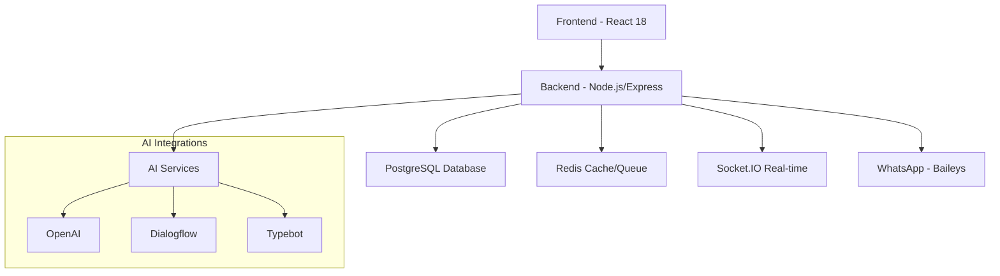

# 💻 Guia de Desenvolvimento

Documentação completa para desenvolvimento no sistema Whaticket, incluindo configuração do ambiente, padrões de código e workflows.

## 🚀 Quick Start para Desenvolvedores

### 1. Setup Rápido

```bash
# Clonar repositório
git clone https://github.com/canove/whaticket-community.git
cd whaticket-community

# Setup com Docker (recomendado)
docker-compose up -d

# OU setup manual
cd whaticket/backend && npm install && npm run dev &
cd whaticket/frontend && npm install && npm start
```

### 2. Primeiro Login

- **URL**: http://localhost:3000
- **Email**: admin@seudominio.com  
- **Senha**: admin123

## 🏗️ Arquitetura de Desenvolvimento

### Stack Tecnológico



### Estrutura de Pastas

```
whaticket/
├── backend/                 # API Node.js
│   ├── src/
│   │   ├── controllers/     # Controladores REST
│   │   ├── services/        # Lógica de negócio (40+ serviços)
│   │   ├── models/          # Modelos Sequelize
│   │   ├── database/        # Migrações e seeds
│   │   ├── middleware/      # Middlewares customizados
│   │   ├── routes/          # Definição de rotas
│   │   ├── libs/            # Bibliotecas auxiliares
│   │   ├── utils/           # Utilitários
│   │   └── jobs/            # Jobs assíncronos
│   ├── public/              # Assets estáticos
│   └── package.json
└── frontend/               # Interface React
    ├── src/
    │   ├── components/      # Componentes React (200+)
    │   ├── pages/           # Páginas/Rotas
    │   ├── context/         # Contextos React
    │   ├── services/        # Serviços API
    │   ├── hooks/           # Custom hooks
    │   └── utils/           # Utilitários frontend
    └── package.json
```

## 🛠️ Configuração do Ambiente de Desenvolvimento

### Pré-requisitos

```bash
# Node.js (via nvm recomendado)
curl -o- https://raw.githubusercontent.com/nvm-sh/nvm/v0.39.0/install.sh | bash
nvm install 20 && nvm use 20

# Ferramentas essenciais
npm install -g nodemon typescript ts-node

# Extensões VS Code recomendadas
code --install-extension ms-vscode.vscode-typescript-next
code --install-extension esbenp.prettier-vscode
code --install-extension bradlc.vscode-tailwindcss
code --install-extension ms-vscode.vscode-json
```

### Configuração Backend (.env.development)

```env
# === DESENVOLVIMENTO ===
NODE_ENV=development
PORT=8080
FRONTEND_URL=http://localhost:3000
BACKEND_URL=http://localhost:8080

# === BANCO DE DADOS ===
DB_DIALECT=postgres
DB_HOST=localhost
DB_PORT=5432
DB_NAME=whaticket_dev
DB_USER=whaticket
DB_PASS=dev123
DB_LOGGING=true

# === REDIS ===
IO_REDIS_SERVER=localhost
IO_REDIS_PORT=6379
IO_REDIS_DB_SESSION=0

# === JWT (desenvolvimento) ===
JWT_SECRET=dev-jwt-secret-key-32-chars-min
JWT_REFRESH_SECRET=dev-refresh-secret-32-chars

# === DEBUG ===
DEBUG=whaticket:*
LOG_LEVEL=debug

# === WHATSAPP (desenvolvimento) ===
CHROME_ARGS=--no-sandbox --disable-setuid-sandbox --disable-dev-shm-usage
WEB_VERSION=2.2409.2
```

### Configuração Frontend (.env.development)

```env
REACT_APP_BACKEND_URL=http://localhost:8080
REACT_APP_ENVIRONMENT=development
GENERATE_SOURCEMAP=true
REACT_APP_DEBUG=true
```

## 🎯 Workflows de Desenvolvimento

### 1. Desenvolvimento Backend

```bash
cd whaticket/backend

# Instalar dependências
npm install

# Executar migrações
npm run db:migrate

# Executar seeds (dados de teste)
npm run db:seed

# Modo desenvolvimento (com hot reload)
npm run dev

# Executar testes
npm test

# Build para produção
npm run build
```

### 2. Desenvolvimento Frontend

```bash
cd whaticket/frontend

# Instalar dependências
npm install

# Modo desenvolvimento
npm start

# Executar testes
npm test

# Build para produção
npm run build

# Analisar bundle
npm run analyze
```

### 3. Desenvolvimento Full-Stack (Docker)

```bash
# Subir ambiente completo
docker-compose -f docker-compose.dev.yml up

# Logs em tempo real
docker-compose logs -f backend frontend

# Executar comandos no container
docker-compose exec backend npm run db:migrate
docker-compose exec backend npm run db:seed
```

## 📝 Padrões de Código

### Backend (Node.js/TypeScript)

#### Estrutura de Serviço

```typescript
// src/services/ExampleService/CreateExampleService.ts
import { Example } from "../../models/Example";

interface CreateExampleData {
  name: string;
  companyId: number;
}

class CreateExampleService {
  public async execute({
    name,
    companyId
  }: CreateExampleData): Promise<Example> {
    // Validações
    if (!name) {
      throw new Error("Name is required");
    }

    // Lógica de negócio
    const example = await Example.create({
      name,
      companyId
    });

    return example;
  }
}

export default CreateExampleService;
```

#### Estrutura de Controller

```typescript
// src/controllers/ExampleController.ts
import { Request, Response } from "express";
import CreateExampleService from "../services/ExampleService/CreateExampleService";

export const create = async (req: Request, res: Response): Promise<Response> => {
  try {
    const { companyId } = req.user;
    const { name } = req.body;

    const example = await new CreateExampleService().execute({
      name,
      companyId
    });

    return res.status(201).json(example);
  } catch (error) {
    return res.status(400).json({ error: error.message });
  }
};
```

#### Estrutura de Model

```typescript
// src/models/Example.ts
import {
  Table,
  Column,
  CreatedAt,
  UpdatedAt,
  Model,
  PrimaryKey,
  AutoIncrement,
  BelongsTo,
  ForeignKey
} from "sequelize-typescript";
import Company from "./Company";

@Table
class Example extends Model<Example> {
  @PrimaryKey
  @AutoIncrement
  @Column
  id: number;

  @Column
  name: string;

  @ForeignKey(() => Company)
  @Column
  companyId: number;

  @BelongsTo(() => Company)
  company: Company;

  @CreatedAt
  createdAt: Date;

  @UpdatedAt
  updatedAt: Date;
}

export default Example;
```

### Frontend (React/TypeScript)

#### Componente Funcional com Hooks

```tsx
// src/components/ExampleForm/index.tsx
import React, { useState, useEffect } from 'react';
import { 
  Dialog,
  DialogTitle,
  DialogContent,
  DialogActions,
  TextField,
  Button
} from '@material-ui/core';
import { toast } from 'react-toastify';
import api from '../../services/api';

interface ExampleFormProps {
  open: boolean;
  onClose: () => void;
  exampleId?: number;
  onSuccess: () => void;
}

const ExampleForm: React.FC<ExampleFormProps> = ({
  open,
  onClose,
  exampleId,
  onSuccess
}) => {
  const [name, setName] = useState('');
  const [loading, setLoading] = useState(false);

  useEffect(() => {
    if (exampleId) {
      loadExample();
    }
  }, [exampleId]);

  const loadExample = async () => {
    try {
      const { data } = await api.get(`/examples/${exampleId}`);
      setName(data.name);
    } catch (error) {
      toast.error('Erro ao carregar exemplo');
    }
  };

  const handleSubmit = async () => {
    try {
      setLoading(true);

      if (exampleId) {
        await api.put(`/examples/${exampleId}`, { name });
      } else {
        await api.post('/examples', { name });
      }

      toast.success('Exemplo salvo com sucesso!');
      onSuccess();
      onClose();
    } catch (error) {
      toast.error('Erro ao salvar exemplo');
    } finally {
      setLoading(false);
    }
  };

  return (
    <Dialog open={open} onClose={onClose} maxWidth="sm" fullWidth>
      <DialogTitle>
        {exampleId ? 'Editar Exemplo' : 'Criar Exemplo'}
      </DialogTitle>
      <DialogContent>
        <TextField
          label="Nome"
          value={name}
          onChange={(e) => setName(e.target.value)}
          fullWidth
          margin="normal"
          required
        />
      </DialogContent>
      <DialogActions>
        <Button onClick={onClose}>
          Cancelar
        </Button>
        <Button
          onClick={handleSubmit}
          color="primary"
          variant="contained"
          disabled={!name || loading}
        >
          {loading ? 'Salvando...' : 'Salvar'}
        </Button>
      </DialogActions>
    </Dialog>
  );
};

export default ExampleForm;
```

## 🔧 Ferramentas de Desenvolvimento

### Scripts npm Úteis

```json
{
  "scripts": {
    "dev": "nodemon src/server.ts",
    "build": "tsc",
    "start": "node dist/server.js",
    "test": "jest",
    "test:watch": "jest --watch",
    "db:migrate": "sequelize db:migrate",
    "db:seed": "sequelize db:seed:all",
    "db:reset": "sequelize db:drop && sequelize db:create && npm run db:migrate && npm run db:seed",
    "lint": "eslint src --ext .ts,.tsx",
    "lint:fix": "eslint src --ext .ts,.tsx --fix",
    "type-check": "tsc --noEmit"
  }
}
```

### Configuração ESLint (.eslintrc.js)

```javascript
module.exports = {
  extends: [
    '@typescript-eslint/recommended',
    'prettier/@typescript-eslint',
    'plugin:prettier/recommended'
  ],
  parser: '@typescript-eslint/parser',
  plugins: ['@typescript-eslint'],
  rules: {
    '@typescript-eslint/explicit-function-return-type': 'off',
    '@typescript-eslint/no-explicit-any': 'off',
    '@typescript-eslint/no-unused-vars': ['error', { argsIgnorePattern: '^_' }],
    'prettier/prettier': 'error'
  }
};
```

### Configuração Prettier (.prettierrc)

```json
{
  "semi": true,
  "trailingComma": "es5",
  "singleQuote": false,
  "printWidth": 80,
  "tabWidth": 2
}
```

## 🧪 Testes

### Backend (Jest + Supertest)

```typescript
// __tests__/integration/example.test.ts
import request from 'supertest';
import app from '../../src/app';
import { truncate } from '../utils/database';

describe('Example API', () => {
  beforeEach(async () => {
    await truncate();
  });

  it('should create a new example', async () => {
    const response = await request(app)
      .post('/examples')
      .send({
        name: 'Test Example'
      })
      .expect(201);

    expect(response.body).toHaveProperty('id');
    expect(response.body.name).toBe('Test Example');
  });

  it('should list examples', async () => {
    const response = await request(app)
      .get('/examples')
      .expect(200);

    expect(Array.isArray(response.body)).toBe(true);
  });
});
```

### Frontend (Jest + React Testing Library)

```tsx
// src/components/ExampleForm/__tests__/ExampleForm.test.tsx
import React from 'react';
import { render, screen, fireEvent, waitFor } from '@testing-library/react';
import ExampleForm from '../index';

const mockOnClose = jest.fn();
const mockOnSuccess = jest.fn();

describe('ExampleForm', () => {
  beforeEach(() => {
    jest.clearAllMocks();
  });

  it('should render form correctly', () => {
    render(
      <ExampleForm
        open={true}
        onClose={mockOnClose}
        onSuccess={mockOnSuccess}
      />
    );

    expect(screen.getByText('Criar Exemplo')).toBeInTheDocument();
    expect(screen.getByLabelText('Nome')).toBeInTheDocument();
  });

  it('should call onSuccess after successful submit', async () => {
    render(
      <ExampleForm
        open={true}
        onClose={mockOnClose}
        onSuccess={mockOnSuccess}
      />
    );

    fireEvent.change(screen.getByLabelText('Nome'), {
      target: { value: 'Test Example' }
    });

    fireEvent.click(screen.getByText('Salvar'));

    await waitFor(() => {
      expect(mockOnSuccess).toHaveBeenCalled();
    });
  });
});
```

## 🐛 Debug e Logging

### Backend Debug

```typescript
// src/utils/logger.ts
import winston from 'winston';

const logger = winston.createLogger({
  level: process.env.LOG_LEVEL || 'info',
  format: winston.format.combine(
    winston.format.timestamp(),
    winston.format.errors({ stack: true }),
    winston.format.json()
  ),
  transports: [
    new winston.transports.File({ filename: 'logs/error.log', level: 'error' }),
    new winston.transports.File({ filename: 'logs/combined.log' }),
    new winston.transports.Console({
      format: winston.format.simple()
    })
  ]
});

export default logger;
```

### Frontend Debug

```typescript
// src/utils/debug.ts
const DEBUG = process.env.REACT_APP_DEBUG === 'true';

export const debugLog = (message: string, data?: any) => {
  if (DEBUG) {
    console.log(`[DEBUG] ${message}`, data);
  }
};

export const debugError = (message: string, error?: any) => {
  if (DEBUG) {
    console.error(`[ERROR] ${message}`, error);
  }
};
```

## 🚀 Deploy de Desenvolvimento

### Ambiente de Staging

```bash
# Build aplicação
npm run build

# Deploy para staging
git push origin staging

# Ou com Docker
docker build -t whaticket:staging .
docker run -d -p 8080:8080 whaticket:staging
```

## 📚 Recursos Adicionais

### Documentação de APIs

- [**Endpoints REST**](../api/rest.md) - Documentação completa das APIs
- [**WebSocket Events**](../api/websocket.md) - Eventos Socket.IO
- [**Database Schema**](../api/database.md) - Estrutura do banco

### Guias Específicos

- [**WhatsApp Integration**](../integrations/whatsapp/development.md) - Desenvolvimento com WhatsApp
- [**AI Integration**](../integrations/ai/development.md) - Desenvolvimento com IA
- [**FlowBuilder**](../features/flowbuilder.md) - Sistema de chatbots visuais

### Troubleshooting

- [**Problemas Comuns**](../troubleshooting/common-issues.md) - Soluções para problemas frequentes
- [**Performance**](../troubleshooting/performance.md) - Otimização de performance
- [**Database Issues**](../troubleshooting/database.md) - Problemas com banco de dados

---

## 🤝 Contribuindo

1. **Fork** o repositório
2. **Clone** seu fork: `git clone https://github.com/seuusuario/whaticket-community.git`
3. **Crie uma branch**: `git checkout -b feature/nova-funcionalidade`
4. **Faça suas alterações** seguindo os padrões de código
5. **Execute os testes**: `npm test`
6. **Commit**: `git commit -m "feat: adiciona nova funcionalidade"`
7. **Push**: `git push origin feature/nova-funcionalidade`
8. **Abra um Pull Request**

### Convenção de Commits

```
feat: nova funcionalidade
fix: correção de bug
docs: atualização de documentação
style: formatação de código
refactor: refatoração de código
test: adição ou correção de testes
chore: tarefas de manutenção
```

---

*Este guia está em constante evolução. Contribuições são bem-vindas!*