# 📱 Integração WhatsApp Business

Guia completo para configuração e integração do WhatsApp Business API com o sistema Whaticket, incluindo setup, troubleshooting e otimizações.

## 🎯 Visão Geral

O Whaticket suporta múltiplas formas de integração com WhatsApp:

### Métodos de Integração

| Método | Tecnologia | Recomendado Para | Limitações |
|--------|------------|------------------|------------|
| **WhatsApp Web** | Baileys | Pequenas/Médias empresas | ~5 dispositivos |
| **WhatsApp Business API** | Oficial Meta | Empresas grandes | Aprovação necessária |
| **WhatsApp Cloud API** | Meta Cloud | Todos os tamanhos | Rate limits |

### Recursos Suportados

✅ **Mensagens de Texto**  
✅ **Mídias (Imagem, Vídeo, Áudio, Documento)**  
✅ **Mensagens de Localização**  
✅ **Contatos (vCard)**  
✅ **Botões Interativos**  
✅ **Listas de Opções**  
✅ **Templates de Mensagem**  
✅ **Status de Entrega (ACK)**  
✅ **Webhooks para Eventos**  
✅ **Múltiplas Sessões**  

## 🚀 Setup Inicial

### Pré-requisitos

```bash
# Dependências necessárias no servidor
sudo apt-get update
sudo apt-get install -y \
  gconf-service libasound2 libatk1.0-0 libcairo-gobject2 \
  libdrm2 libgdk-pixbuf2.0-0 libgtk-3-0 libnspr4 libx11-xcb1 \
  libxcb-dri3-0 libxcomposite1 libxcursor1 libxdamage1 libxfixes3 \
  libxi6 libxinerama1 libxrandr2 libxrender1 libxss1 libxtst6 \
  ca-certificates fonts-liberation libappindicator1 libnss3 \
  lsb-release xdg-utils wget google-chrome-stable
```

### Variáveis de Ambiente

```env
# WhatsApp Configuration
WEB_VERSION=2.2409.2
CHROME_BIN=/usr/bin/google-chrome-stable
CHROME_ARGS=--no-sandbox --disable-setuid-sandbox --disable-dev-shm-usage --disable-gpu

# Session Storage
SESSION_SECRET=ultra-secure-session-secret-key
STORE_MESSAGES=true
STORE_MESSAGE_UP_TO=90

# Media Settings
MAX_FILE_SIZE=20971520
ALLOWED_EXTENSIONS=jpg,jpeg,png,gif,mp4,mp3,pdf,doc,docx,xls,xlsx

# Rate Limiting
MESSAGES_PER_MINUTE=30
BULK_MESSAGE_DELAY=2000
```

## 📲 Conectando WhatsApp Web

### 1. Criar Nova Conexão

```javascript
// Via Frontend
const newConnection = {
  name: "WhatsApp Principal",
  queueIds: [1, 2], // IDs das filas
  isDefault: true    // Conexão padrão
};

// Via API
const response = await fetch('/api/whatsapps', {
  method: 'POST',
  headers: {
    'Authorization': `Bearer ${token}`,
    'Content-Type': 'application/json'
  },
  body: JSON.stringify(newConnection)
});
```

### 2. Conectar via QR Code

```mermaid
sequenceDiagram
    participant U as Usuário
    participant F as Frontend
    participant B as Backend
    participant W as WhatsApp
    
    U->>F: Criar conexão
    F->>B: POST /api/whatsapps
    B->>B: Inicializar Baileys
    B->>F: QR Code gerado
    F->>U: Exibir QR Code
    U->>W: Escanear com celular
    W->>B: Autenticação
    B->>F: Status: CONNECTED
    F->>U: Conexão estabelecida
```



### 3. Processo de Conexão

#### Passo 1: Gerar QR Code

```typescript
// backend/src/services/WbotServices/StartWhatsAppSession.ts
import { WASocket, useMultiFileAuthState } from '@whiskeysockets/baileys';

const startSession = async (whatsapp: Whatsapp) => {
  const { state, saveCreds } = await useMultiFileAuthState(
    path.join(__dirname, '..', '..', '..', 'public', `session-${whatsapp.id}`)
  );

  const sock = makeWASocket({
    auth: state,
    printQRInTerminal: false,
    browser: ['Whaticket', 'Chrome', '110.0.0.0'],
    version: [2, 2409, 2]
  });

  sock.ev.on('connection.update', async (update) => {
    const { connection, lastDisconnect, qr } = update;
    
    if (qr) {
      await whatsapp.update({ 
        qrcode: qr,
        status: 'qrcode' 
      });
      
      // Emitir QR Code via Socket.IO
      io.emit('whatsappSession', {
        action: 'update',
        session: { id: whatsapp.id, qrcode: qr, status: 'qrcode' }
      });
    }
    
    if (connection === 'open') {
      await whatsapp.update({ 
        status: 'CONNECTED',
        qrcode: null,
        retries: 0 
      });
      
      io.emit('whatsappSession', {
        action: 'update',
        session: { id: whatsapp.id, status: 'CONNECTED' }
      });
    }
  });
};
```

#### Passo 2: Verificar Status

```bash
# Via logs
docker-compose logs -f backend | grep -i whatsapp

# Via API
curl -H "Authorization: Bearer $TOKEN" \
     http://localhost:8080/api/whatsapps/1

# Response
{
  "id": 1,
  "name": "WhatsApp Principal",
  "status": "CONNECTED", // qrcode, CONNECTED, DISCONNECTED
  "qrcode": null,
  "retries": 0
}
```

### 4. Troubleshooting Conexão

#### QR Code não aparece

```bash
# Verificar logs do Chrome
docker-compose exec backend ls -la public/
docker-compose logs backend | grep -i chrome

# Verificar dependências
docker-compose exec backend which google-chrome-stable
docker-compose exec backend google-chrome-stable --version
```

#### Conexão perdida frequentemente

```env
# Ajustar configurações de rede
CHROME_ARGS=--no-sandbox --disable-setuid-sandbox --disable-dev-shm-usage --disable-gpu --no-first-run --disable-extensions --disable-background-timer-throttling

# Aumentar timeout
CONNECTION_TIMEOUT=60000
PING_INTERVAL=30000
```

## 💬 Envio de Mensagens

### Mensagens de Texto

```typescript
// Simples
await sock.sendMessage(jid, { text: 'Olá! Como posso ajudá-lo?' });

// Com citação
await sock.sendMessage(jid, {
  text: 'Esta é uma resposta à sua mensagem',
  quoted: originalMessage
});

// Com menção
await sock.sendMessage(jid, {
  text: 'Olá @5511999999999! Tudo bem?',
  mentions: ['5511999999999@s.whatsapp.net']
});
```

### Mensagens com Mídia

```typescript
// Imagem
await sock.sendMessage(jid, {
  image: { url: 'https://example.com/image.jpg' },
  caption: 'Descrição da imagem'
});

// Vídeo
await sock.sendMessage(jid, {
  video: { url: 'https://example.com/video.mp4' },
  caption: 'Vídeo demonstrativo',
  gifPlayback: false
});

// Documento
await sock.sendMessage(jid, {
  document: { url: 'https://example.com/doc.pdf' },
  mimetype: 'application/pdf',
  fileName: 'documento.pdf'
});

// Áudio
await sock.sendMessage(jid, {
  audio: { url: 'https://example.com/audio.mp3' },
  mimetype: 'audio/mp3',
  ptt: true // true para nota de voz
});
```

### Mensagens Interativas

#### Botões

```typescript
await sock.sendMessage(jid, {
  text: 'Escolha uma opção:',
  buttons: [
    { buttonId: 'btn1', buttonText: { displayText: 'Opção 1' }, type: 1 },
    { buttonId: 'btn2', buttonText: { displayText: 'Opção 2' }, type: 1 },
    { buttonId: 'btn3', buttonText: { displayText: 'Opção 3' }, type: 1 }
  ],
  headerType: 1
});
```

#### Lista de Opções

```typescript
await sock.sendMessage(jid, {
  text: 'Selecione um departamento:',
  sections: [{
    title: 'Departamentos',
    rows: [
      { title: 'Vendas', description: 'Equipe de vendas', rowId: 'vendas' },
      { title: 'Suporte', description: 'Suporte técnico', rowId: 'suporte' },
      { title: 'Financeiro', description: 'Setor financeiro', rowId: 'financeiro' }
    ]
  }],
  buttonText: 'Selecionar',
  listType: 1
});
```

### Templates de Mensagem

```typescript
// Template aprovado pelo WhatsApp Business
await sock.sendMessage(jid, {
  templateMessage: {
    hydratedTemplate: {
      hydratedContentText: 'Olá {{1}}! Seu pedido {{2}} está pronto para retirada.',
      hydratedButtons: [{
        urlButton: {
          displayText: 'Rastrear Pedido',
          url: 'https://example.com/track/{{3}}'
        }
      }]
    }
  }
});
```

## 📨 Recebimento de Mensagens

### Listener Principal

```typescript
// backend/src/services/WbotServices/wbotMessageListener.ts
sock.ev.on('messages.upsert', async ({ messages, type }) => {
  if (type !== 'notify') return;
  
  for (const msg of messages) {
    if (msg.key.fromMe) continue;
    
    await handleMessage(msg, whatsapp);
  }
});

const handleMessage = async (msg: WAMessage, whatsapp: Whatsapp) => {
  try {
    // Identificar contato
    const contact = await verifyContact(msg, whatsapp.companyId);
    
    // Buscar ou criar ticket
    const ticket = await findOrCreateTicket(contact, whatsapp, msg);
    
    // Criar mensagem
    const message = await CreateMessageService({
      messageData: {
        id: msg.key.id,
        ticketId: ticket.id,
        contactId: contact.id,
        body: getBodyMessage(msg),
        fromMe: false,
        mediaType: getMediaType(msg),
        mediaUrl: await downloadMedia(msg),
        timestamp: msg.messageTimestamp,
        quotedMsgId: msg.message?.extendedTextMessage?.contextInfo?.stanzaId
      }
    });
    
    // Emitir via Socket.IO
    io.to(ticket.id.toString()).emit('appMessage', {
      action: 'create',
      message,
      ticket,
      contact
    });
    
    // Processar automações
    await handleChatbot(ticket, message, whatsapp);
    
  } catch (error) {
    logger.error('Error handling message:', error);
  }
};
```

### Processamento de Mídias

```typescript
const downloadMedia = async (msg: WAMessage): Promise<string | null> => {
  try {
    if (!msg.message) return null;
    
    const messageType = Object.keys(msg.message)[0];
    
    if (!['imageMessage', 'videoMessage', 'audioMessage', 'documentMessage'].includes(messageType)) {
      return null;
    }
    
    const media = await downloadMediaMessage(
      msg,
      'buffer',
      {},
      {
        logger: console,
        reuploadRequest: sock.updateMediaMessage
      }
    );
    
    const filename = `${msg.key.id}_${Date.now()}`;
    const filepath = path.join('public', 'uploads', filename);
    
    await fs.writeFile(filepath, media);
    
    return `/uploads/${filename}`;
    
  } catch (error) {
    logger.error('Error downloading media:', error);
    return null;
  }
};
```

## 🤖 Integração com Chatbots

### Configuração Básica

```typescript
// Verificar se deve processar chatbot
const shouldProcessChatbot = (ticket: Ticket, message: Message): boolean => {
  // Não processar se:
  // - Mensagem é do atendente
  if (message.fromMe) return false;
  
  // - Ticket já tem atendente humano
  if (ticket.userId && ticket.status === 'open') return false;
  
  // - Fora do horário de funcionamento
  const isWorkingHours = await checkWorkingHours(ticket.companyId);
  if (!isWorkingHours) return false;
  
  return true;
};

// Processar fluxo do chatbot
const handleChatbot = async (ticket: Ticket, message: Message, whatsapp: Whatsapp) => {
  if (!shouldProcessChatbot(ticket, message)) return;
  
  const chatbot = await findActiveChatbot(ticket.queueId);
  if (!chatbot) return;
  
  // Processar resposta do chatbot
  const response = await processChatbotFlow(
    chatbot,
    message.body,
    ticket.contact,
    ticket
  );
  
  if (response) {
    await SendWhatsAppMessage({
      body: response.message,
      ticket,
      media: response.media
    });
    
    // Atualizar contexto do chatbot
    await updateChatbotContext(ticket, response.nextStep);
  }
};
```

### FlowBuilder Integration

```typescript
// Integração com FlowBuilder visual
const processFlowBuilder = async (flowId: number, input: string, context: any) => {
  const flow = await Flow.findByPk(flowId, {
    include: [{ model: FlowStep, as: 'steps' }]
  });
  
  let currentStep = flow.steps.find(step => 
    step.id === context.currentStepId || step.isInitial
  );
  
  if (!currentStep) return null;
  
  // Processar condições
  const nextStep = await evaluateConditions(currentStep, input, context);
  
  // Executar ações
  const actions = await executeStepActions(currentStep, context);
  
  return {
    message: currentStep.message,
    media: actions.media,
    nextStep: nextStep?.id,
    actions: actions.list
  };
};
```

## 📊 Monitoramento e Métricas

### Status da Conexão

```typescript
// Health check endpoint
app.get('/api/whatsapp/:id/status', async (req, res) => {
  const { id } = req.params;
  
  const whatsapp = await Whatsapp.findByPk(id);
  if (!whatsapp) {
    return res.status(404).json({ error: 'WhatsApp not found' });
  }
  
  const wbot = getWbot(whatsapp.id);
  const isConnected = wbot?.user?.id ? true : false;
  
  const status = {
    id: whatsapp.id,
    name: whatsapp.name,
    status: whatsapp.status,
    isConnected,
    lastSeen: wbot?.user?.id ? new Date() : whatsapp.updatedAt,
    qrCode: whatsapp.qrcode,
    retries: whatsapp.retries
  };
  
  res.json(status);
});
```

### Métricas de Mensagens

```sql
-- Mensagens por período
SELECT 
  DATE(m."createdAt") as date,
  COUNT(*) as total_messages,
  COUNT(CASE WHEN m."fromMe" = true THEN 1 END) as sent_messages,
  COUNT(CASE WHEN m."fromMe" = false THEN 1 END) as received_messages
FROM "Messages" m
INNER JOIN "Tickets" t ON t.id = m."ticketId"
WHERE t."whatsappId" = :whatsappId
  AND m."createdAt" >= :startDate
  AND m."createdAt" <= :endDate
GROUP BY DATE(m."createdAt")
ORDER BY date DESC;

-- Performance por conexão
SELECT 
  w.id,
  w.name,
  w.status,
  COUNT(DISTINCT t.id) as total_tickets,
  COUNT(m.id) as total_messages,
  AVG(EXTRACT(EPOCH FROM (t."updatedAt" - t."createdAt"))/60) as avg_resolution_minutes
FROM "Whatsapps" w
LEFT JOIN "Tickets" t ON t."whatsappId" = w.id
LEFT JOIN "Messages" m ON m."ticketId" = t.id
WHERE w."companyId" = :companyId
GROUP BY w.id, w.name, w.status;
```

## 🔒 Segurança e Compliance

### Criptografia de Sessões

```typescript
const crypto = require('crypto');

// Criptografar dados da sessão
const encryptSessionData = (data: string, key: string): string => {
  const cipher = crypto.createCipher('aes-256-cbc', key);
  let encrypted = cipher.update(data, 'utf8', 'hex');
  encrypted += cipher.final('hex');
  return encrypted;
};

// Descriptografar dados da sessão
const decryptSessionData = (encryptedData: string, key: string): string => {
  const decipher = crypto.createDecipher('aes-256-cbc', key);
  let decrypted = decipher.update(encryptedData, 'hex', 'utf8');
  decrypted += decipher.final('utf8');
  return decrypted;
};
```

### Backup de Sessões

```bash
#!/bin/bash
# backup-whatsapp-sessions.sh

BACKUP_DIR="/opt/backups/whatsapp-sessions"
SOURCE_DIR="/opt/whaticket/public"
TIMESTAMP=$(date +"%Y%m%d_%H%M%S")

mkdir -p $BACKUP_DIR

# Backup das sessões
tar -czf "$BACKUP_DIR/sessions_backup_$TIMESTAMP.tar.gz" \
    -C $SOURCE_DIR \
    --exclude="*.log" \
    session-*

# Limpar backups antigos (manter 30 dias)
find $BACKUP_DIR -name "sessions_backup_*.tar.gz" -mtime +30 -delete

echo "Session backup completed: $TIMESTAMP"
```

### LGPD/GDPR Compliance

```typescript
// Anonimizar dados de contatos
const anonymizeContact = async (contactId: number) => {
  await Contact.update({
    name: `Anonymous_${Date.now()}`,
    number: `***${Math.random().toString(36).substr(2, 8)}`,
    email: null,
    profilePicUrl: null
  }, {
    where: { id: contactId }
  });
  
  // Anonimizar mensagens
  await Message.update({
    body: '[MENSAGEM REMOVIDA POR SOLICITAÇÃO]'
  }, {
    where: { contactId }
  });
};

// Exportar dados do usuário
const exportUserData = async (contactNumber: string) => {
  const contact = await Contact.findOne({
    where: { number: contactNumber },
    include: [
      {
        model: Ticket,
        include: [{ model: Message }]
      }
    ]
  });
  
  return {
    personal_data: {
      name: contact.name,
      number: contact.number,
      email: contact.email
    },
    conversations: contact.tickets.map(ticket => ({
      id: ticket.id,
      created_at: ticket.createdAt,
      messages: ticket.messages.map(msg => ({
        body: msg.body,
        timestamp: msg.createdAt,
        from_me: msg.fromMe
      }))
    }))
  };
};
```

## 🚀 Otimizações de Performance

### Rate Limiting

```typescript
const rateLimiter = new Map();

const checkRateLimit = (number: string): boolean => {
  const now = Date.now();
  const windowStart = now - (60 * 1000); // 1 minuto
  
  if (!rateLimiter.has(number)) {
    rateLimiter.set(number, []);
  }
  
  const requests = rateLimiter.get(number);
  
  // Remover requisições antigas
  const validRequests = requests.filter(time => time > windowStart);
  
  if (validRequests.length >= 30) { // Max 30 mensagens por minuto
    return false;
  }
  
  validRequests.push(now);
  rateLimiter.set(number, validRequests);
  
  return true;
};
```

### Connection Pool

```typescript
const connectionPool = new Map();
const MAX_CONNECTIONS = 50;

const getConnection = async (whatsappId: number): Promise<WASocket> => {
  if (connectionPool.has(whatsappId)) {
    return connectionPool.get(whatsappId);
  }
  
  if (connectionPool.size >= MAX_CONNECTIONS) {
    // Remover conexão menos usada
    const leastUsed = findLeastUsedConnection();
    await closeConnection(leastUsed);
    connectionPool.delete(leastUsed);
  }
  
  const connection = await createNewConnection(whatsappId);
  connectionPool.set(whatsappId, connection);
  
  return connection;
};
```

## 📚 Recursos Adicionais

### Webhook Configuration

```typescript
// Configurar webhook para receber eventos
app.post('/webhook/whatsapp/:id', async (req, res) => {
  const { id } = req.params;
  const { event, data } = req.body;
  
  switch (event) {
    case 'message':
      await processIncomingMessage(data, id);
      break;
    case 'status':
      await updateMessageStatus(data);
      break;
    case 'connection':
      await updateConnectionStatus(id, data.status);
      break;
  }
  
  res.json({ success: true });
});
```

### Multi-device Support

```typescript
// Suporte a múltiplos dispositivos
const enableMultiDevice = async (whatsappId: number) => {
  const wbot = getWbot(whatsappId);
  
  // Habilitar multi-device
  await wbot.sendMessage(wbot.user.id, {
    text: '!enable-md'
  });
  
  // Configurar dispositivos secundários
  wbot.ev.on('connection.update', (update) => {
    if (update.qr) {
      // QR Code para dispositivo secundário
      handleSecondaryDeviceQR(whatsappId, update.qr);
    }
  });
};
```

### API Limits Monitoring

```typescript
// Monitorar limites da API
const apiLimits = {
  messages_per_day: 1000,
  media_per_day: 100,
  current_messages: 0,
  current_media: 0,
  last_reset: new Date()
};

const checkApiLimits = (): boolean => {
  const now = new Date();
  
  // Reset diário
  if (now.getDate() !== apiLimits.last_reset.getDate()) {
    apiLimits.current_messages = 0;
    apiLimits.current_media = 0;
    apiLimits.last_reset = now;
  }
  
  return apiLimits.current_messages < apiLimits.messages_per_day;
};
```

## 🆘 Suporte e Troubleshooting

### Logs Detalhados

```bash
# Habilitar debug do Baileys
DEBUG=baileys:* npm run dev

# Logs específicos do WhatsApp
docker-compose logs backend | grep -i "whatsapp\|baileys\|session"

# Monitorar conexões em tempo real
tail -f logs/whatsapp.log | grep -i "connection\|qr\|auth"
```

### Ferramentas de Debug

```typescript
// Debug tool para analisar sessões
const analyzeSession = async (whatsappId: number) => {
  const sessionPath = path.join('public', `session-${whatsappId}`);
  
  const analysis = {
    exists: fs.existsSync(sessionPath),
    files: [],
    size: 0,
    lastModified: null
  };
  
  if (analysis.exists) {
    const files = fs.readdirSync(sessionPath);
    analysis.files = files;
    
    files.forEach(file => {
      const filePath = path.join(sessionPath, file);
      const stats = fs.statSync(filePath);
      analysis.size += stats.size;
      
      if (!analysis.lastModified || stats.mtime > analysis.lastModified) {
        analysis.lastModified = stats.mtime;
      }
    });
  }
  
  return analysis;
};
```

### Recovery Procedures

```bash
#!/bin/bash
# recover-whatsapp-session.sh

WHATSAPP_ID=$1
SESSION_DIR="public/session-${WHATSAPP_ID}"
BACKUP_DIR="backups/sessions"

if [ -z "$WHATSAPP_ID" ]; then
    echo "Usage: $0 <whatsapp_id>"
    exit 1
fi

echo "Recovering WhatsApp session $WHATSAPP_ID..."

# Parar o serviço
docker-compose stop backend

# Remover sessão corrompida
rm -rf $SESSION_DIR

# Restaurar do backup mais recente
LATEST_BACKUP=$(ls -t $BACKUP_DIR/sessions_backup_*.tar.gz | head -1)
if [ -n "$LATEST_BACKUP" ]; then
    echo "Restoring from: $LATEST_BACKUP"
    tar -xzf $LATEST_BACKUP -C public/
else
    echo "No backup found. Manual reconnection required."
fi

# Reiniciar serviço
docker-compose start backend

echo "Session recovery completed. Check logs for status."
```

---

## 📋 Checklist de Configuração

### Setup Inicial
- [ ] Dependências do sistema instaladas
- [ ] Variáveis de ambiente configuradas
- [ ] Chrome/Chromium funcionando
- [ ] Portas liberadas no firewall

### Primeira Conexão
- [ ] Conexão WhatsApp criada no sistema
- [ ] QR Code gerado corretamente
- [ ] Escaneado com dispositivo móvel
- [ ] Status mudou para CONNECTED
- [ ] Teste de envio/recebimento funcionando

### Configurações Avançadas
- [ ] Filas associadas à conexão
- [ ] Chatbots configurados
- [ ] Horário de funcionamento definido
- [ ] Rate limiting configurado
- [ ] Backup de sessões agendado

### Monitoramento
- [ ] Logs sendo gerados
- [ ] Métricas sendo coletadas
- [ ] Alertas configurados
- [ ] Health check funcionando

*Para suporte adicional, consulte o [Troubleshooting Guide](../../troubleshooting/whatsapp-issues.md) ou entre em contato conosco.*