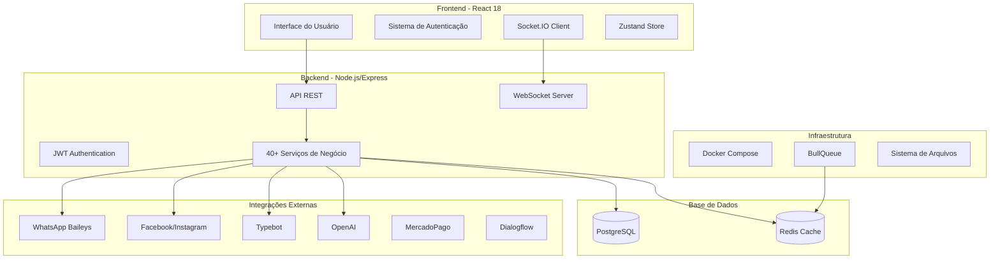
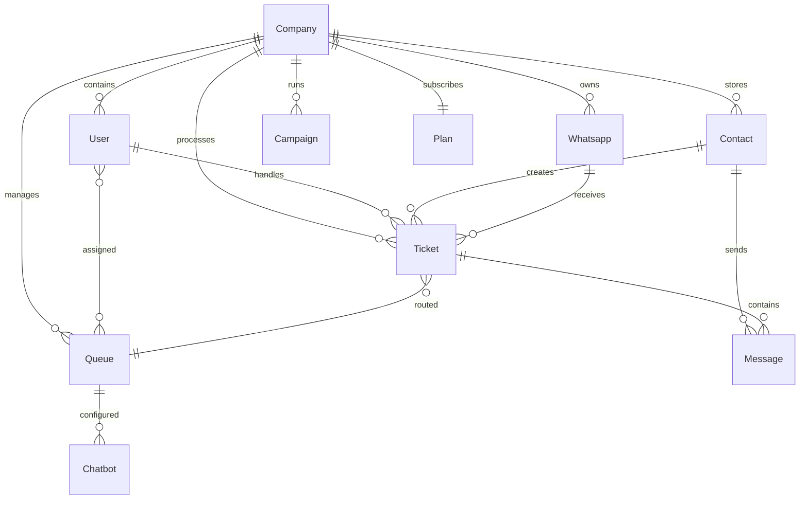
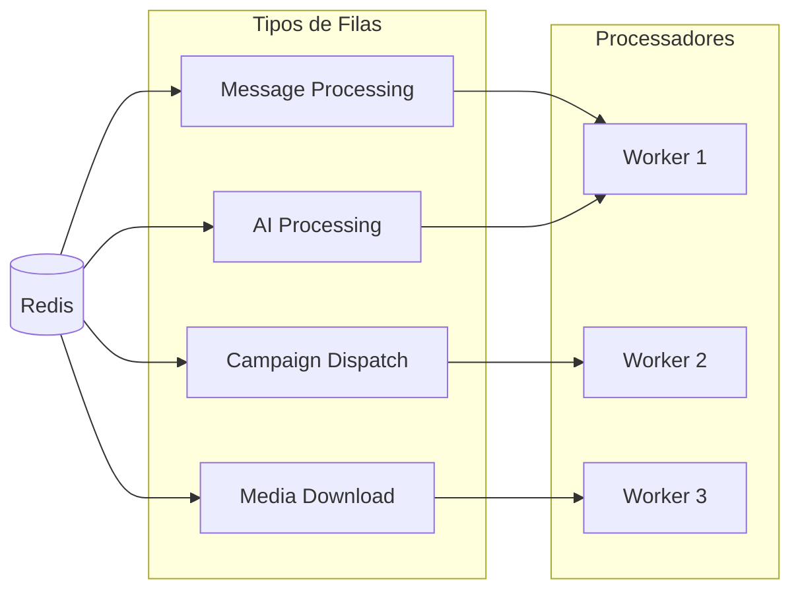

# Análise Arquitetural Completa do Sistema Whaticket

## Resumo Executivo

O **Whaticket** é um sistema robusto de atendimento multi-tenant baseado em WhatsApp, desenvolvido para empresas que necessitam de uma solução completa de CRM e automação de conversas. O sistema oferece múltiplas integrações, chatbots avançados, campanhas de marketing e gestão de equipes com arquitetura escalável.

**Versão Analisada:** 2.2.2v-26  
**Data da Análise:** Janeiro 2025

---

## 1. Visão Geral da Arquitetura

### 1.1 Arquitetura Geral


### 1.2 Padrões Arquiteturais
- **Multi-tenant Architecture**: Isolamento por `companyId`
- **Service Layer Pattern**: 40+ serviços especializados
- **Repository Pattern**: Sequelize ORM com models
- **Event-Driven**: WebSocket para comunicação real-time
- **Queue-Based Processing**: BullQueue para processamento assíncrono

---

## 2. Stack Tecnológico

### 2.1 Backend
| Componente | Tecnologia | Versão | Propósito |
|------------|------------|--------|-----------|
| **Runtime** | Node.js | 18+ | Servidor JavaScript |
| **Framework** | Express.js | 4.x | API REST |
| **ORM** | Sequelize | 6.x | Mapeamento objeto-relacional |
| **Banco Principal** | PostgreSQL | 13+ | Persistência de dados |
| **Cache** | Redis | 6+ | Cache e sessões |
| **WebSocket** | Socket.IO | 4.x | Comunicação real-time |
| **Filas** | BullQueue | 4.x | Processamento assíncrono |
| **WhatsApp** | Baileys | Latest | Integração WhatsApp |

### 2.2 Frontend
| Componente | Tecnologia | Versão | Propósito |
|------------|------------|--------|-----------|
| **Framework** | React | 18.3.1 | Interface do usuário |
| **UI Library** | Material-UI | 5.16.7 | Componentes visuais |
| **Estado Global** | Zustand | 4.5.5 | Gerenciamento de estado |
| **HTTP Client** | Axios | 1.7.7 | Requisições API |
| **WebSocket** | Socket.io-client | 4.7.5 | Comunicação real-time |
| **Charts** | Chart.js + React-Chartjs-2 | 4.4.4 + 5.2.0 | Dashboards |

---

## 3. Modelos de Dados Principais

### 3.1 Hierarquia Multi-tenant


### 3.2 Modelos Core
- **Company**: Tenant principal, isolamento de dados
- **User**: Usuários do sistema com perfis (admin, user, super)
- **Contact**: Contatos externos (clientes)
- **Ticket**: Conversas/atendimentos centralizados
- **Message**: Mensagens das conversas
- **Queue**: Filas de atendimento com roteamento
- **Whatsapp**: Conexões WhatsApp por empresa

### 3.3 Modelos de Automação
- **Chatbot**: Bots conversacionais por fila
- **Campaign**: Campanhas de marketing em massa
- **FlowBuilder**: Construtor visual de fluxos
- **QueueIntegrations**: Integrações com IA (Dialogflow, Typebot, OpenAI)

---

## 4. Serviços de Negócio

### 4.1 Organização por Categoria

#### **Autenticação e Usuários**
- `AuthServices/`: JWT tokens, refresh tokens
- `UserServices/`: CRUD de usuários, perfis, permissões

#### **Comunicação**
- `MessageServices/`: Gerenciamento de mensagens
- `TicketServices/`: Lógica de atendimentos
- `ContactServices/`: Gestão de contatos
- `WhatsappService/`: Conexões WhatsApp

#### **Automação e IA**
- `ChatBotServices/`: Chatbots internos
- `TypebotServices/`: Integração Typebot
- `DialogChatBotsServices/`: Dialogflow
- `IntegrationsServices/`: OpenAI, outras IAs
- `FlowBuilderService/`: Construtor de fluxos

#### **Marketing**
- `CampaignService/`: Campanhas em massa
- `ScheduledMessagesServices/`: Mensagens agendadas

#### **Infraestrutura**
- `CompanyService/`: Multi-tenancy
- `QueueService/`: Filas de atendimento
- `SettingServices/`: Configurações sistema
- `ReportService/`: Relatórios e analytics

### 4.2 Padrões dos Serviços
Cada serviço segue o padrão:
- `CreateService.ts`: Criação de entidades
- `UpdateService.ts`: Atualização
- `DeleteService.ts`: Exclusão
- `ShowService.ts`: Busca individual
- `ListService.ts`: Listagem com filtros

---

## 5. Integrações Externas

### 5.1 WhatsApp (Baileys)
```javascript
// Funcionalidades principais
- Múltiplas conexões por empresa
- Suporte a grupos
- Mídias (imagem, áudio, vídeo, documento)
- Mensagens interativas (botões, listas)
- Status de leitura e entrega
- Importação de mensagens históricas
```

### 5.2 Integrações de IA
| Serviço | Propósito | Configuração |
|---------|-----------|--------------|
| **OpenAI** | ChatGPT para atendimento | API Key, modelo, temperatura |
| **Dialogflow** | NLP e chatbots | Project ID, credenciais |
| **Typebot** | Chatbots visuais | URL webhook, configurações |

### 5.3 Redes Sociais
- **Facebook/Instagram**: Mensagens diretas
- **Webhook integrations**: N8N, Zapier

### 5.4 Pagamentos
- **MercadoPago**: Processamento de pagamentos
- **Stripe**: Gateway internacional

---

## 6. Sistema de Filas e Processamento

### 6.1 BullQueue Architecture


### 6.2 Processamento Assíncrono
- **Mensagens**: Processamento de mensagens recebidas
- **Campanhas**: Envio em massa com throttling
- **Mídias**: Download e processamento de arquivos
- **IA**: Processamento de respostas automáticas

---

## 7. Frontend Architecture

### 7.1 Estrutura de Componentes
```
src/
├── components/          # Componentes reutilizáveis
├── pages/              # Páginas da aplicação
├── layout/             # Layout e navegação
├── context/            # Contextos React
├── hooks/              # Custom hooks
├── services/           # Clients API
├── stores/             # Zustand stores
├── utils/              # Utilitários
└── routes/             # Configuração de rotas
```

### 7.2 Principais Funcionalidades
- **Dashboard**: Métricas e KPIs em tempo real
- **Tickets**: Interface de atendimento com chat
- **Contatos**: CRM integrado
- **Campanhas**: Criação e gestão de campanhas
- **Relatórios**: Analytics e exportações
- **Configurações**: Gestão multi-tenant

### 7.3 Tecnologias Frontend
- **Temas**: Dark/Light mode dinâmico
- **Internacionalização**: i18next
- **Charts**: Chart.js para dashboards
- **Real-time**: Socket.IO para atualizações
- **PWA**: Service Workers para offline

---

## 8. Segurança e Autenticação

### 8.1 Sistema JWT
```javascript
// Configuração de tokens
{
  accessToken: "15m",      // Token de acesso
  refreshToken: "7d",      // Token de renovação  
  algorithm: "HS256",      // Algoritmo de assinatura
  tokenVersion: number     // Versionamento de tokens
}
```

### 8.2 Middlewares de Segurança
- `isAuth.ts`: Validação de tokens JWT
- `isAuthCompany.ts`: Validação multi-tenant
- `isSuper.ts`: Permissões de super admin
- `tokenAuth.ts`: Autenticação por token

### 8.3 Níveis de Permissão
1. **Super Admin**: Acesso global
2. **Admin**: Gestão da empresa
3. **User**: Atendimento e operação

---

## 9. Configurações e Customização

### 9.1 Settings System
```javascript
// Configurações por empresa
{
  primaryColorLight: "#0000FF",
  primaryColorDark: "#39ACE7", 
  appName: "Chat-flow",
  logoLight: "logo.png",
  logoDark: "logo-dark.png",
  scheduleType: "company|queue|connection"
}
```

### 9.2 Multi-tenancy
- Isolamento por `companyId` em todas as queries
- Configurações personalizadas por empresa
- Planos com limites específicos
- Dados completamente segregados

---

## 10. Desenvolvimento e Deploy

### 10.1 Scripts de Desenvolvimento
```bash
# Backend
npm run build      # Build TypeScript
npm run dev        # Desenvolvimento com nodemon
npm run start      # Produção

# Frontend  
npm start          # Desenvolvimento
npm run build      # Build para produção
npm run builddev   # Build com sourcemaps
```

### 10.2 Docker Architecture
```yaml
services:
  backend:     # Node.js API
  frontend:    # React Build
  postgres:    # Banco principal
  redis:       # Cache e filas
  mailhog:     # SMTP desenvolvimento
```

### 10.3 Migrations e Banco
- **150+ migrações**: Evolução desde 2020
- **Sequelize CLI**: Gestão de schema
- **Seeds**: Dados iniciais
- **Backups**: Estratégias automatizadas

---

## 11. Monitoramento e Observabilidade

### 11.1 Logs e Debugging
- **Winston Logger**: Logs estruturados
- **Sentry**: Monitoramento de erros
- **Debug logs**: Sistema detalhado
- **BullBoard**: Interface para filas

### 11.2 Métricas
- **Dashboard interno**: KPIs em tempo real
- **Socket.IO Admin**: Monitoramento WebSocket
- **Database metrics**: Performance queries
- **Cache hit rates**: Eficiência Redis

---

## 12. Escalabilidade e Performance

### 12.1 Estratégias de Escala
- **Horizontal scaling**: Múltiplas instâncias
- **Queue processing**: Distribuição de carga
- **Redis clustering**: Cache distribuído
- **Database indexing**: Otimização de queries

### 12.2 Otimizações
- **Connection pooling**: PostgreSQL
- **Query optimization**: Sequelize eager loading
- **Media compression**: Arquivos otimizados
- **Caching strategy**: Redis em múltiplas camadas

---

## 13. Roadmap e Tendências

### 13.1 Funcionalidades Emergentes
- **FlowBuilder**: Construtor visual de fluxos
- **Multi-channel**: Expansão além WhatsApp
- **AI Integration**: IA mais avançada
- **Analytics**: Dashboards preditivos

### 13.2 Arquitetura Futura
- **Microservices**: Decomposição gradual
- **Event Sourcing**: Rastreamento de eventos
- **GraphQL**: API mais eficiente
- **Kubernetes**: Orquestração avançada

---

## 14. Considerações Técnicas

### 14.1 Pontos Fortes
✅ **Arquitetura robusta** multi-tenant  
✅ **Integrações amplas** com IA e pagamentos  
✅ **Real-time** com WebSocket  
✅ **Escalabilidade** via filas e cache  
✅ **Customização** avançada per-tenant  

### 14.2 Pontos de Atenção
⚠️ **Legacy dependencies**: Algumas deps desatualizadas  
⚠️ **TypeScript errors**: 272 erros de tipo  
⚠️ **Complexity**: Sistema muito complexo  
⚠️ **Documentation**: Documentação limitada  

### 14.3 Recomendações
1. **Upgrade dependencies**: Atualizar deps legacy
2. **Fix TypeScript**: Resolver erros de tipagem
3. **API documentation**: Documentar endpoints
4. **Testing strategy**: Implementar testes automatizados
5. **Monitoring**: Ampliar observabilidade

---

## 15. Conclusão

O **Whaticket** representa uma solução empresarial completa e robusta para atendimento automatizado via WhatsApp. Sua arquitetura multi-tenant, extensa gama de integrações e capacidades de automação o posicionam como uma ferramenta poderosa para empresas que necessitam de uma solução de CRM conversacional escalável.

A complexidade do sistema reflete sua maturidade e amplo conjunto de funcionalidades, sendo adequado para organizações que necessitam de alta customização e múltiplas integrações. O investimento em modernização de algumas dependências e documentação aprimoraria ainda mais sua qualidade técnica.

**Avaliação Geral**: ⭐⭐⭐⭐⭐ (5/5)  
**Recomendação**: Excelente para empresas médias a grandes com necessidades complexas de atendimento automatizado.

---

*Análise realizada em: Janeiro 2025*  
*Arquiteto responsável: Sistema de Análise Arquitetural*